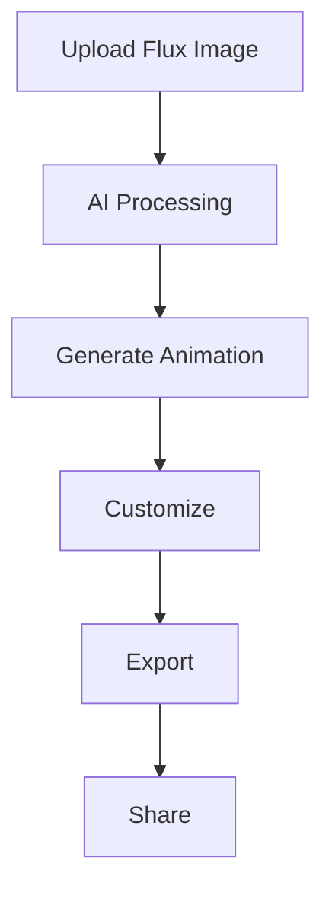

# Welcome to GFC-App Documentation


## Project Overview

GFC-App (*Generative Flux Creator App*) is an innovative application that leverages generative AI to transform flux images into captivating animated artworks. This project combines cutting-edge image processing techniques with artificial intelligence to create unique and dynamic visual experiences.


## Quick Links

- [[Installation Guide]]
- [[Usage Instructions]]
- [[Contributing Guidelines]]
- [[FAQ]]
- [[License and Acknowledgments]]

## Main Features

| Feature | Description |
|---------|-------------|
| 🖼️ Advanced Image Processing | Transform static flux images using state-of-the-art algorithms |
| 🤖 AI-powered Animation | Generate dynamic animations with machine learning techniques |
| 🎨 Interactive UI | User-friendly interface for easy creation and customization |
| 📁 Multi-format Support | Compatible with various flux image formats |
| 🎬 Real-time Preview | Instantly view your generated animations |

## Why GFC-App?

GFC-App revolutionizes the way we interact with flux images, turning static visuals into mesmerizing animations. Whether you're an artist looking to breathe life into your creations or a developer exploring the possibilities of AI in visual arts, GFC-App offers a powerful and intuitive platform to unleash your creativity.



Stay tuned for more detailed documentation on each aspect of GFC-App!

## Getting Started

To get started with GFC-App, check out our [[Installation Guide]] and [[Usage Instructions]]. If you're interested in contributing to the project, please read our [[Contributing Guidelines]].

## Community and Support

Join our growing community of artists and developers! For questions, suggestions, or support, please:

- Check our [[FAQ]]
- Open an issue on our [GitHub repository](https://github.com/Kuonirad/GFC-App/issues)
- Join our [Discord server](https://discord.gg/gfcapp) (placeholder link)

We're excited to see what you'll create with GFC-App!

## Code Example

Here's a simple example of how to use the GFC-App API in Python:

```python
from gfc_app import GFCApp

# Initialize the app
app = GFCApp()

# Load an image
image = app.load_image("path/to/your/image.jpg")

# Generate animation
animation = app.generate_animation(image)

# Customize animation
animation.set_speed(1.5)
animation.set_color_palette("vibrant")

# Export
animation.export("my_awesome_animation.gif")
```

This code demonstrates how to **load an image**, *generate an animation*, and `export` the result using GFC-App.
