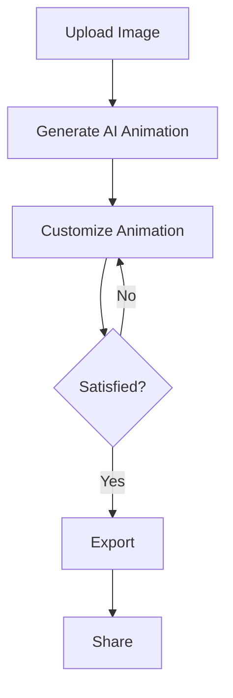

# Usage Instructions for GFC-App

## Video Tutorial

Click the image above to watch our comprehensive video tutorial on using GFC-App.

## Feature Overview

### 1. Image Upload

- Click on the "Upload" button in the top-left corner of the interface.
- Select a flux image file from your local storage.
- Supported formats: .jpg, .png, .tiff

### 2. AI Animation Generation

- Once an image is uploaded, click on the "Generate Animation" button.
- The AI will process the image and create an animated version.
- Processing time may vary depending on image complexity.

### 3. Customization Tools

- Use the sidebar on the right to access customization options:
  - Animation Speed: Adjust the slider to change the speed of the animation.
  - Color Palette: Choose from predefined palettes or create your own.
  - Effect Intensity: Control the intensity of the AI-generated effects.

### 4. Real-time Preview

- The main canvas shows a real-time preview of your animation.
- Use the play/pause button to control the preview.

### 5. Export

- Click the "Export" button to save your creation.
- Choose between .gif or .mp4 formats.

## Animated Feature Demonstration

This animated GIF demonstrates the key features of GFC-App in action.

## User Interface Guide

1. **Top Bar**: Contains the upload button, project name, and save/load options.
2. **Main Canvas**: Displays your current work and preview.
3. **Right Sidebar**: Houses all customization tools and options.
4. **Bottom Bar**: Shows the timeline of your animation and playback controls.

## Workflow Diagram

This diagram illustrates the typical workflow when using GFC-App.

## Examples

### Example 1: Creating a Subtle Animation
1. Upload a serene landscape flux image.
2. Generate the initial animation.
3. Reduce the Effect Intensity to 30%.
4. Slow down the Animation Speed to create a gentle, flowing effect.
5. Export as a looping .gif for use as a desktop background.

### Example 2: Energetic Abstract Art
1. Upload an abstract flux image with vibrant colors.
2. Generate the initial animation.
3. Increase the Effect Intensity to 80%.
4. Adjust the Color Palette to emphasize contrasting hues.
5. Speed up the Animation Speed for a dynamic result.
6. Export as an .mp4 for sharing on social media.

Remember, the key to creating stunning animations with GFC-App is experimentation. Don't hesitate to play with different settings and see what unique effects you can achieve!

## Additional Resources
- [GFC-App Community Forum](https://community.gfcapp.com)
- [Advanced Techniques Guide](https://docs.gfcapp.com/advanced-techniques)
- [GFC-App API Documentation](https://api.gfcapp.com)

For more information and support, visit our [official website](https://www.gfcapp.com).
