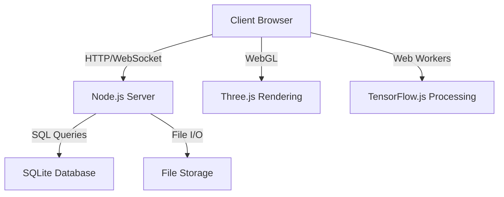

# GFC-App Architecture Overview

## High-Level Architecture

GFC-App follows a client-server architecture with a React-based frontend and a Node.js backend. The application leverages TensorFlow.js for AI-powered image processing and Three.js for 3D rendering capabilities.

## Key Components

1. **Frontend (React)**
   - User Interface
   - State Management (Redux)
   - WebGL Rendering (Three.js)
   - AI Processing (TensorFlow.js)

2. **Backend (Node.js + Express)**
   - API Endpoints
   - Authentication & Authorization
   - Data Persistence (SQLite)
   - File Management

3. **Database (SQLite)**
   - User Data
   - Project Metadata
   - AI Model Configurations

4. **AI Processing**
   - Image Analysis
   - Animation Generation
   - Style Transfer

5. **3D Rendering**
   - Scene Management
   - Shader Programming
   - Performance Optimization

## Data Flow

1. User uploads an image through the React UI.
2. Image is sent to the Node.js server for initial processing and storage.
3. Frontend requests AI processing using TensorFlow.js.
4. AI-generated animation data is sent to Three.js for rendering.
5. User interactions and project data are persisted in the SQLite database.

## Scalability Considerations

- Implement caching mechanisms for frequently accessed data.
- Utilize WebWorkers for computationally intensive tasks.
- Implement lazy loading for large assets and components.
- Consider serverless functions for specific AI processing tasks.

## Security Measures

- Implement JWT for authentication and authorization.
- Use HTTPS for all client-server communications.
- Sanitize and validate all user inputs.
- Implement rate limiting to prevent abuse.

## Future Enhancements

- Integrate cloud storage solutions for scalable file management.
- Implement real-time collaboration features using WebSockets.
- Explore WebAssembly for performance-critical computations.
- Develop a plugin system for extensibility.

This architecture provides a solid foundation for GFC-App, balancing performance, scalability, and maintainability. As the project evolves, we'll continue to refine and optimize each component to meet growing user needs and technological advancements.
