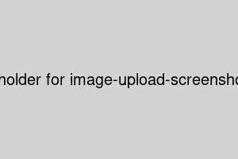
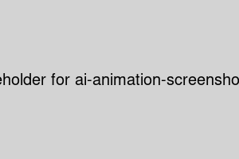
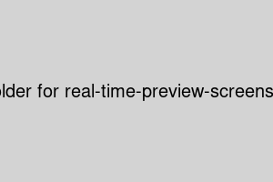

# GFC-App Features

## Image Upload and Processing

GFC-App allows you to easily upload and process your flux images. Simply drag and drop your image into the designated area or use the file picker to select your image.

**Supported Formats:**
- JPEG
- PNG
- TIFF

## AI-Powered Animation Generation

Our cutting-edge AI models transform your static flux images into mesmerizing animations. Choose from various AI models to create unique visual experiences.

**Key AI Features:**
- Pattern recognition
- Dynamic motion generation
- Style transfer capabilities

## Real-time Preview and Customization

Adjust your animation parameters in real-time and see the changes instantly. Fine-tune your creation to perfection before exporting.

**Customization Options:**
| Parameter | Description | Range |
|-----------|-------------|-------|
| Speed | Animation playback speed | 0.5x - 2.0x |
| Complexity | Level of detail in the animation | 1 - 10 |
| Color Palette | Predefined color schemes | Various options |
| Blend Mode | How layers interact | Normal, Multiply, Screen, etc. |

## Multi-layer Composition

Create complex animations by combining multiple flux images as separate layers. Adjust individual layer properties for unique effects.

**Layer Properties:**
- Opacity
- Blend mode
- Transform (scale, rotate, translate)
- Mask

## Export Options
Choose from various export formats to share your creations or integrate them into other projects.

**Available Formats:**
- GIF
- MP4
- WebM

**Export Settings:**
| Setting | Description |
|---------|-------------|
| Resolution | Choose from preset resolutions or set custom dimensions |
| Frame Rate | Adjust the smoothness of your animation (15-60 FPS) |
| Quality | Balance file size and visual quality |
| Loop | Set the animation to loop or play once |

## Tutorial: Creating Your First Animation

Video tutorial coming soon! Stay tuned for updates.

Follow along with this tutorial to create your first animation using GFC-App. Learn the basics of uploading an image, applying AI models, and customizing your animation.

For more tutorials and advanced techniques, stay tuned for future video content updates.

## Performance Optimization Tips

To ensure smooth performance when working with complex animations:

1. **Use appropriate image sizes**: Start with images no larger than 2048x2048 pixels.
2. **Limit layer count**: For best performance, use no more than 5-10 layers.
3. **Adjust complexity gradually**: Start with lower complexity and increase as needed.
4. **Utilize GPU acceleration**: Enable hardware acceleration in your browser settings.

For more detailed performance tips, check out our [Performance Optimization Guide](Performance-Optimization.md).

---

Ready to start creating? Head over to our [Getting Started Guide](Getting-Started.md) to begin your journey with GFC-App!
