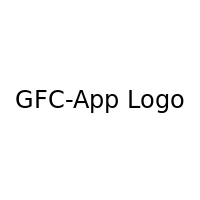
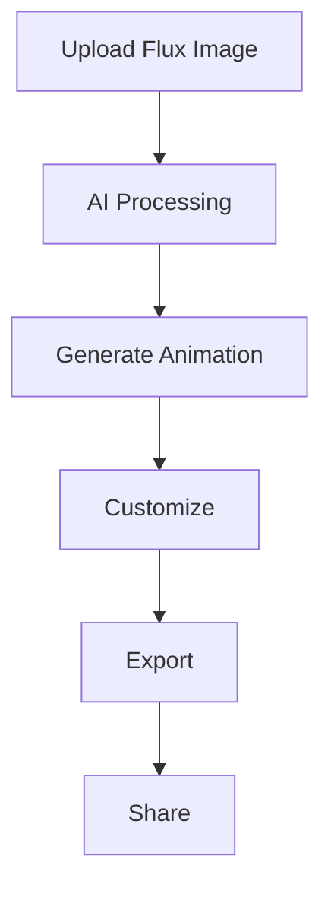

# Welcome to GFC-App Wiki

## ⚠️ Important Note

**This repository is private.** Access to the repository and its contents requires appropriate permissions. Please ensure you have the necessary access rights to view and contribute to the project.

## 📚 Table of Contents
1. [🌟 Project Overview](#project-overview)
2. [🔗 Quick Links](#quick-links)
3. [🎨 Main Features](#main-features)
4. [💡 Why GFC-App?](#why-gfc-app)
5. [🚀 Getting Started](#getting-started)
6. [🤝 Community and Support](#community-and-support)
7. [📢 Latest Updates](#latest-updates)

## 🌟 Project Overview

GFC-App (*Generative Flux Creator App*) is an innovative application that leverages generative AI to transform flux images into captivating animated artworks. This project combines cutting-edge image processing techniques with artificial intelligence to create unique and dynamic visual experiences.

## 🔗 Quick Links

|        📚 [Installation Guide](Installation.md) | 🚀 [Usage Instructions](Usage.md) | 🔧 [Features](Features.md) |
|:----------------------------------------:|:---------------------------------:|:--------------------------------------------------:|
| **🔌 [API Reference](API-Reference.md)** | **🆘 [Troubleshooting](Troubleshooting.md)** | **🏗️ [Architecture Overview](Architecture.md)** |
| **🤝 [Contributing Guidelines](Contributing.md)** | **❓ [FAQ](FAQ.md)** | **📄 [License and Acknowledgments](License-and-Acknowledgments.md)** |

## 🎨 Main Features

Explore the powerful features of GFC-App:

<table align="center">
  <tr>
    <th>Feature</th>
    <th>Description</th>
  </tr>
  <tr>
    <td>🖼️ Advanced Image Processing</td>
    <td>Transform static flux images using state-of-the-art algorithms, including advanced filtering and enhancement techniques.</td>
  </tr>
  <tr>
    <td>🤖 AI-powered Animation</td>
    <td>Generate dynamic animations with machine learning techniques, leveraging TensorFlow.js for real-time processing.</td>
  </tr>
  <tr>
    <td>🎨 Interactive UI</td>
    <td>User-friendly interface built with React and Three.js for easy creation and customization of animations.</td>
  </tr>
  <tr>
    <td>📁 Multi-format Support</td>
    <td>Compatible with various flux image formats, including JPEG, PNG, and custom flux file types.</td>
  </tr>
  <tr>
    <td>🎬 Real-time Preview</td>
    <td>Instantly view your generated animations with our optimized rendering engine.</td>
  </tr>
  <tr>
    <td>💾 Efficient Data Handling</td>
    <td>Utilize SQLite for fast and reliable data storage and retrieval.</td>
  </tr>
  <tr>
    <td>🛠️ Comprehensive Error Management</td>
    <td>Robust error handling and logging system for smooth user experience and easy troubleshooting.</td>
  </tr>
</table>

## 💡 Why GFC-App?

GFC-App revolutionizes the way we interact with flux images, turning static visuals into mesmerizing animations. Whether you're an artist looking to breathe life into your creations or a developer exploring the possibilities of AI in visual arts, GFC-App offers a powerful and intuitive platform to unleash your creativity.

## 🚀 Getting Started

To get started with GFC-App, check out our [Installation Guide](Installation.md) and [Usage Instructions](Usage.md). If you're interested in contributing to the project, please read our [Contributing Guidelines](Contributing.md).

## 🤝 Community and Support

Join our growing community of artists and developers! For questions, suggestions, or support, please:

- Check our [FAQ](FAQ.md)
- Contact the repository owner for access-related inquiries

We're excited to see what you'll create with GFC-App!

## 📢 Latest Updates

Stay up-to-date with the latest features and improvements by contacting the repository owner for access to updates.

For tutorials and demos, visit our [Video Tutorials](Tutorials.md) (coming soon).
