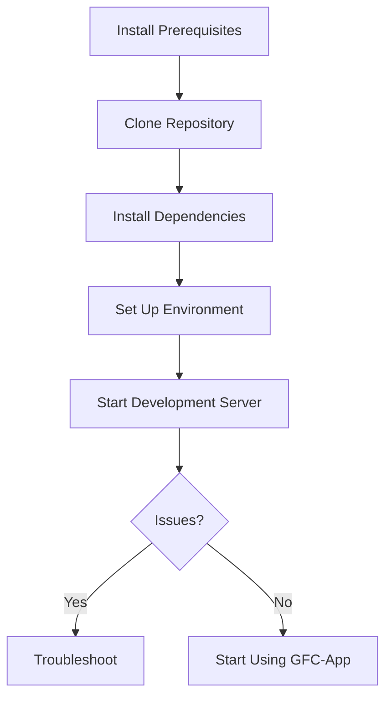

# Installation Guide

## Prerequisites
Before installing GFC-App, ensure you have the following software and tools:

- **Node.js** (v14 or later)
- **pnpm** (v6 or later)
- **Git**

## Installation Steps

1. **Clone the Repository**
   ```bash
   git clone https://github.com/Kuonirad/GFC-App.git
   ```

2. **Navigate to the Project Directory**
   ```bash
   cd GFC-App
   ```

3. **Install Dependencies**
   ```bash
   pnpm install
   ```

4. **Set Up Environment Variables**
   Create a `.env` file in the root directory and add necessary environment variables. You can use the `.env.example` file as a template:
   ```bash
   cp .env.example .env
   ```
   Edit the `.env` file with your specific configuration.

5. **Start the Development Server**
   ```bash
   pnpm start
   ```

   The application should now be running on `http://localhost:3000`.

## Troubleshooting

### Issue: Dependencies fail to install
**Solution:** Try clearing the pnpm cache and reinstalling:
```bash
pnpm store prune
pnpm install
```

### Issue: Application fails to start
**Solution:** Ensure all environment variables are correctly set in your `.env` file. If the issue persists, try removing the `node_modules` folder and reinstalling dependencies:
```bash
rm -rf node_modules
pnpm install
```

### Issue: TensorFlow.js related errors
**Solution:** If you encounter issues related to TensorFlow.js, ensure you have a compatible version of Node.js installed. TensorFlow.js requires Node.js version 12.0.0 or higher.

For any other issues, please check our [FAQ](FAQ.md) or open an issue on our [GitHub repository](https://github.com/Kuonirad/GFC-App/issues).

## Next Steps

After successful installation, you might want to:

1. Explore the [Usage](Usage.md) guide to learn how to use GFC-App
2. Check out the [Architecture](Architecture.md) overview to understand the project structure
3. Read the [Contributing](Contributing.md) guidelines if you're interested in contributing to the project

*Remember to regularly update GFC-App to get the latest features and bug fixes!*



Happy coding with GFC-App! 🎨🖼️🤖
