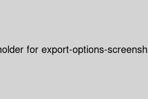

# Usage Instructions

## Table of Contents
1. [Feature Overview](#feature-overview)
2. [User Interface Guide](#user-interface-guide)
3. [Examples](#examples)
4. [Additional Resources](#additional-resources)

---

## Feature Overview

### 1. Image Upload

- Upload your flux images through the intuitive drag-and-drop interface or file selector.
- Supported formats: JPEG, PNG, TIFF

### 2. AI-Powered Animation Generation

- Select from various AI models to generate unique animations from your flux images.
- Adjust parameters like animation speed, color palette, and complexity.

### 3. Real-time Preview

- View your generated animations in real-time as you adjust settings.
- Compare different versions side-by-side.

### 4. Export Options

- Export your animations in various formats: GIF, MP4, WebM
- Customize export settings like resolution and frame rate.

---

## User Interface Guide

1. **Main Dashboard**
   - Navigation menu on the left
   - Recent projects displayed in the center
   - Quick action buttons (New Project, Import, Settings) on the top right

2. **Project Workspace**
   - Image preview on the left
   - Animation controls and parameters on the right
   - Timeline at the bottom for multi-frame animations

3. **Settings Panel**
   - Access via the gear icon in the top right
   - Adjust application preferences, AI model selection, and performance options

---

## Examples

### Example 1: Creating a Simple Animation
1. Upload a flux image to the dashboard.
2. Select the "Basic Animation" AI model.
3. Adjust the speed slider to 1.5x.
4. Click "Generate" and wait for the AI to process.
5. Use the preview window to view your animation.
6. Export as a GIF for easy sharing.

### Example 2: Advanced Multi-layer Animation
1. Upload multiple flux images to create layers.
2. Select the "Multi-layer Fusion" AI model.
3. Adjust individual layer parameters (opacity, blend mode).
4. Set keyframes on the timeline for each layer.
5. Generate the animation and fine-tune as needed.
6. Export as an MP4 for high-quality output.

---

## Additional Resources

For more detailed tutorials and advanced usage scenarios, please check our [Video Tutorials](Tutorials.md) (coming soon).

If you encounter any issues or have questions, please refer to our [FAQ](FAQ.md) or [open an issue](https://github.com/Kuonirad/GFC-App/issues) on our GitHub repository.
